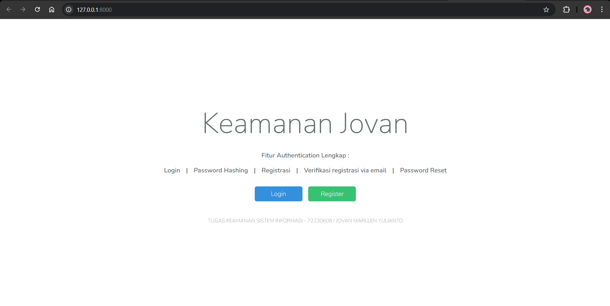
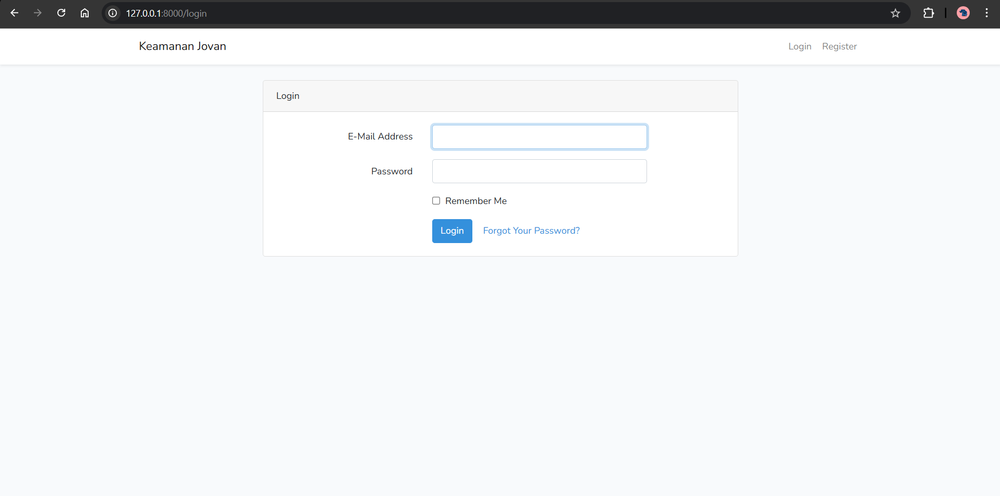
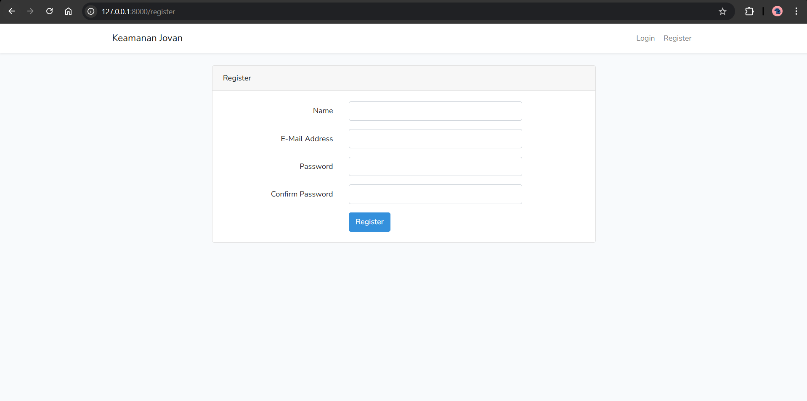
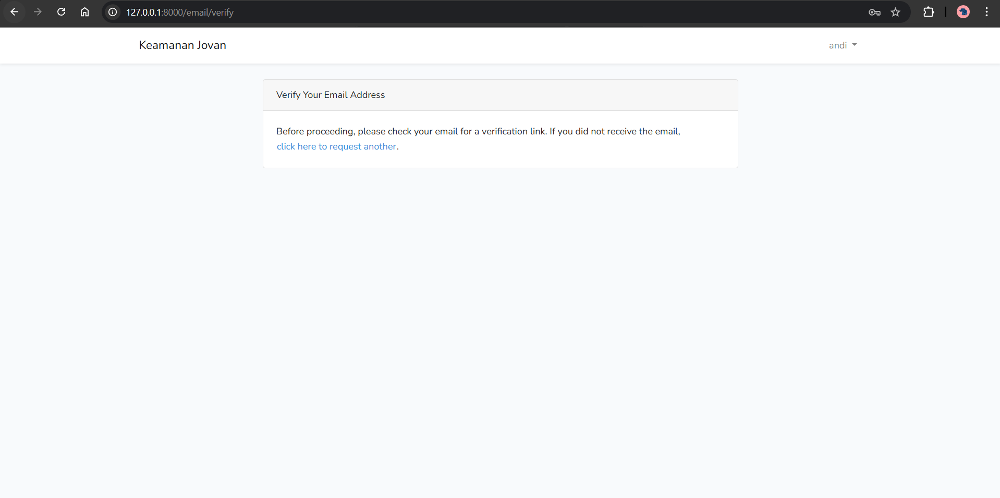
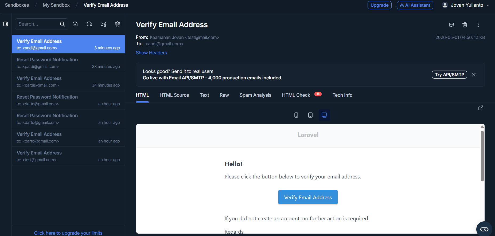
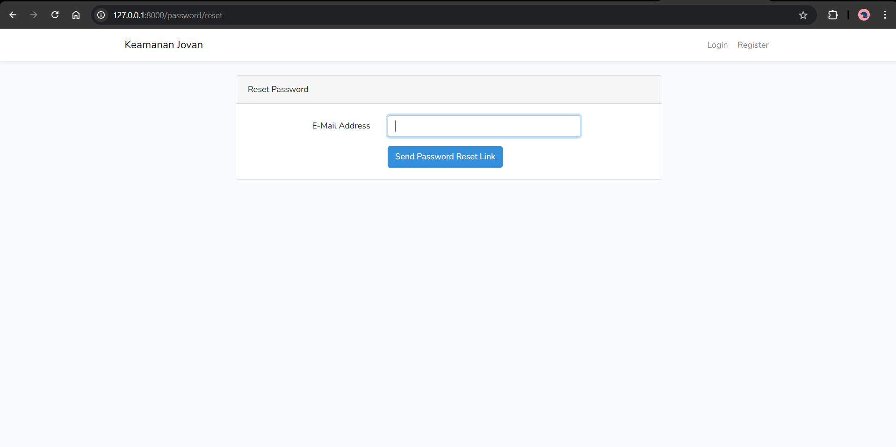
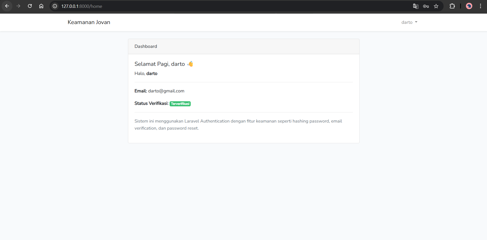

### Author : 72230608 - Jovan Marllen Yulianto - Sistem Informasi - Universitas Kristen Duta Wacana
# 🔐 Sistem Authentication dengan menggunakan Laravel 6

## 📌 Deskripsi
Project ini merupakan implementasi sistem autentikasi berbasis Laravel 6 yang berfokus pada keamanan data pengguna.  
Sistem ini dibuat untuk memenuhi tugas mata kuliah **Keamanan Sistem Informasi**.

---

## ✨ Fitur Sistem
- Login
- Registrasi
- Password Hashing (bcrypt)
- Verifikasi Registrasi via Email (Mailtrap)
- Password Reset

---

## 🔒 Implementasi Keamanan

### 1. Password Hashing
Password tidak disimpan dalam bentuk asli, melainkan di-hash menggunakan bcrypt.

### 2. Email Verification
Pengguna harus melakukan verifikasi email sebelum dapat mengakses sistem.

### 3. Password Reset
Pengguna dapat mengatur ulang password melalui email menggunakan token yang aman.

---

## ⚙️ Teknologi yang Digunakan
- Laravel 6
- PHP
- MySQL
- Mailtrap (Email Testing)

---

## 🚀 Cara Menjalankan Project

### 1. Clone Repository
git clone https://github.com/Jovan-stat/keamanan_jovan
cd keamanan_jovan

### 2. Install Dependency
composer install

### 3. Copy File Environment
cp .env.example .env

### 4. Generate Application Key
php artisan key:generate

### 5. Konfigurasi Database
DB_DATABASE={SESUAIKAN DATABASE}
DB_USERNAME={SESUAIKAN USERNAME}
DB_PASSWORD={SESUAIKAN PASSWORD}

### 6. Jalankan Migration
php artisan migrate

### 7. Konfigurasi Email (Mailtrap)
Project ini menggunakan Mailtrap untuk testing fitur email (verifikasi dan reset password).

Langkah-langkah:
1. Buat akun di https://mailtrap.io
2. Masuk ke menu **Email Sandbox**
3. Pilih inbox
4. Ambil SMTP credentials (host, port, username, password)

Lalu sesuaikan file `.env`:

MAIL_MAILER=smtp
MAIL_HOST=sandbox.smtp.mailtrap.io
MAIL_PORT=2525
MAIL_USERNAME=ISI_USERNAME_DARI_MAILTRAP
MAIL_PASSWORD=ISI_PASSWORD_DARI_MAILTRAP
MAIL_ENCRYPTION=null
MAIL_FROM_ADDRESS=test@mail.com
MAIL_FROM_NAME="Keamanan App"

### 8. Jalankan Server
php artisan serve

---

## 📸 Screenshot

### 🔑 welcome

### 🔑 Login

### 📝 Register

### 📧 Email Confirmation

### 📧 Verification (MailTrap)

### 📧 Forgot Password

### 📊 Dashboard

